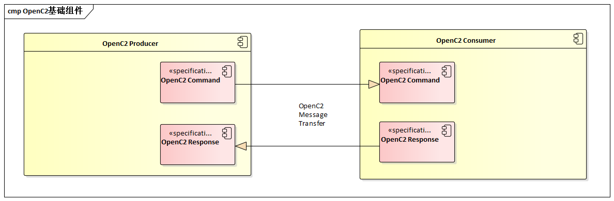
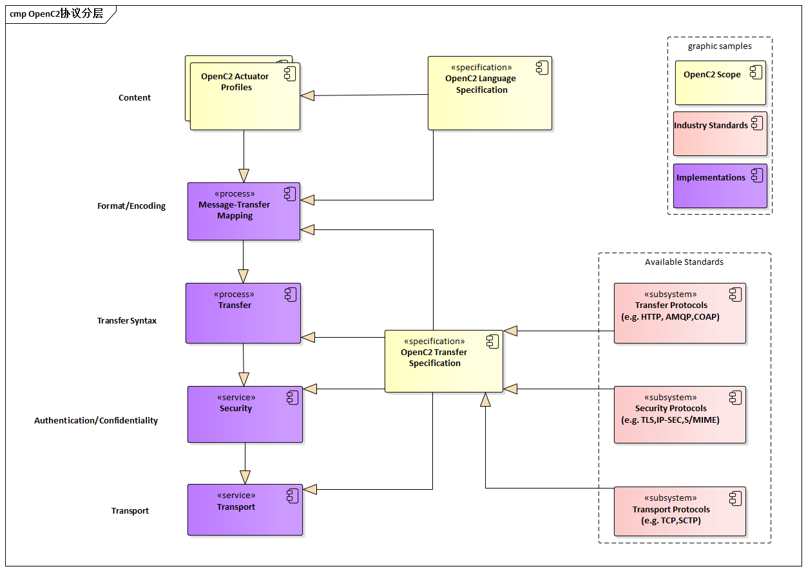
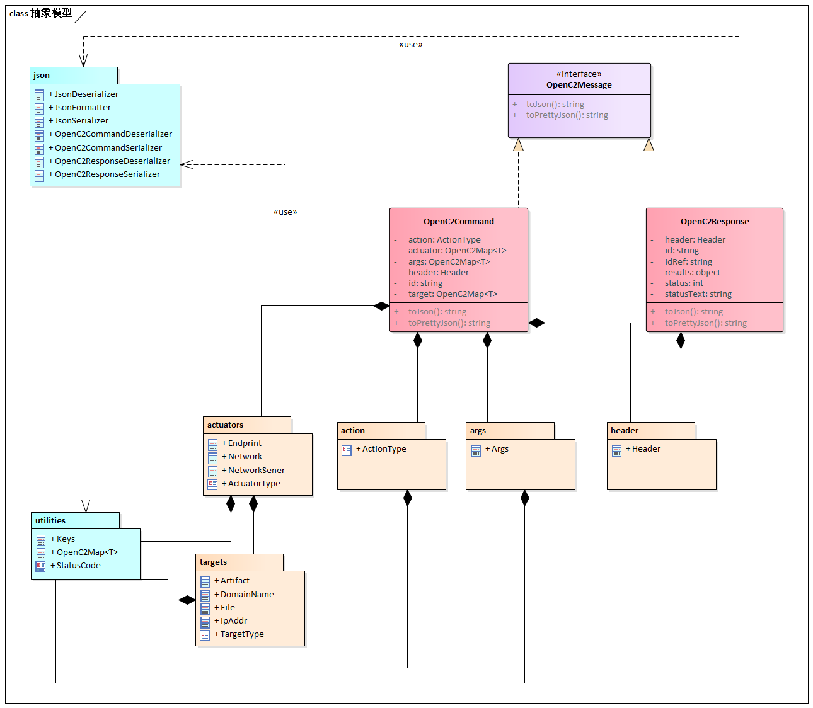
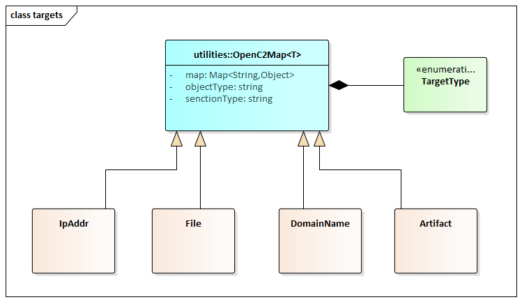
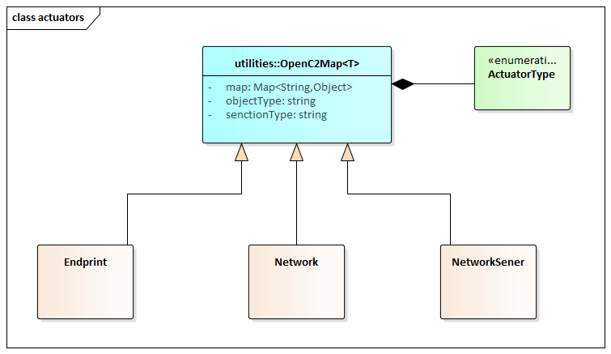
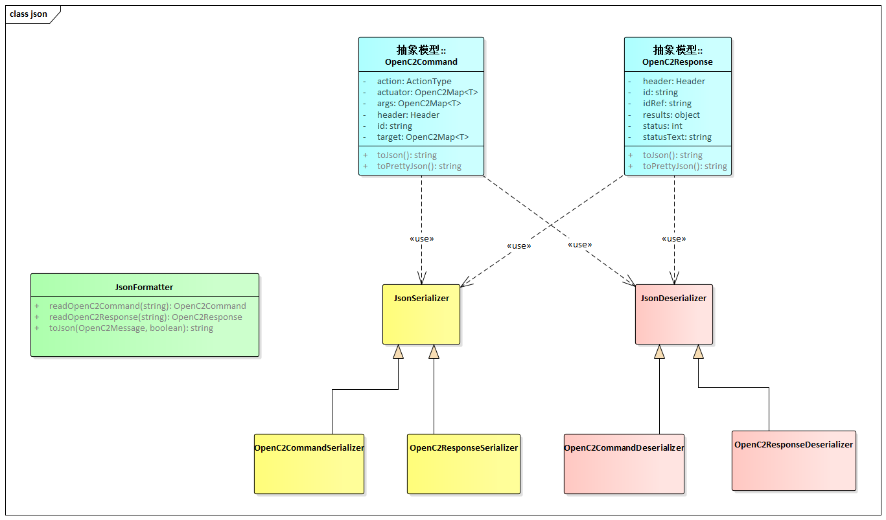

# OpenC2-Java

 

## OpenC2 基础组件

1. **生产者** ：生产者是一个实体，它创建命令以向一个或多个系统提供指令，以根据命令的内容进行操作。 生产者可以与命令一起接收和处理响应。
1. **消费者** ：消费者是接收并可能对命令采取行动的实体。 消费者可以创建响应，提供捕获或发送回制作人所需的任何信息。

## OpenC2消息交换

`OpenC2`是生产者和消费者的一套规范，用于指挥和执行网络防御功能。 这些规范包括`OpenC2`语言规范，执行器配置文件和传输规范。

`OpenC2`语言规范和执行器配置文件规范侧重于命令和响应的生产者和消费者的语言内容和含义，而转移规范侧重于交换协议。

- `OpenC2`语言规范：提供了语言基本元素的语义，命令和响应的结构，以及定义表示命令或响应的语言元素的正确语法的模式。
- `OpenC2`执行器配置文件：指定在特定执行器功能的上下文中相关的`OpenC2`语言的子集。 网络防御组件，设备，系统和/或实例可能（实际上可能）实现多个执行器配置文件。 执行器配置文件通过定义将执行器标识为所需精度级别的说明符来扩展语言。 执行器配置文件可以定义与这些执行器功能相关和/或唯一的命令参数和目标。
- `OpenC2`传输规范：利用现有协议和标准在特定环境中实现`OpenC2`。 这些标准用于超出语言范围的通信和安全功能，例如消息传输编码，身份验证和`OpenC2`消息的端到端传输。

### OpenC2预言规范结构

`OpenC2`语言规范定义了一种语言，用于组成用于命令和控制网络防御系统和组件的消息。 

消息由`Header`和`Payload`组成（在[OpenC2语言规范版本1.0](https://docs.oasis-open.org/openc2/oc2ls/v1.0/cs01/oc2ls-v1.0-cs01.html)中定义为消息主体，并在一个或多个执行器配置文件中指定 ）。

该语言规范定义了两个`Payload`结构

- 命令（`Command`） ：从一个系统（称为生产者）到一个或多个系统（消费者）的指令，用于对命令的内容进行操作。
- 响应 (`Response`)：由命令返回生产者的任何信息。

## OpenC2协议分层

`OpenC2`实现将上述相关的`OpenC2`规范与相关的行业规范，协议和标准集成在一起。 

下图描述了`OpenC2`规范之间的关系，以及它们与其他行业标准和`OpenC2`的特定于环境的实现之间的关系。 

> 注意，图中的实现方面的分层是概念性的，并不旨在排除实现所需功能的任何特定方法
>
>（例如，使用应用层消息签名功能来提供消息源认证和完整性）。

### OpenC2协议层

| 层 | 例子 |
|--|--|
| `Function-Specific Content` | 执行器配置文件   ([[OpenC2-SLPF-v1.0](https://docs.oasis-open.org/openc2/oc2ls/v1.0/cs01/oc2ls-v1.0-cs01.html#openc2-slpf-v10)],...)|
| Common Content | 	Language Specification |
| Message | Transfer Specifications   ([[OpenC2-HTTPS-v1.0](https://docs.oasis-open.org/openc2/oc2ls/v1.0/cs01/oc2ls-v1.0-cs01.html#openc2-https-v10)], OpenC2-over-CoAP, ...) |
| Secure Transport | HTTPS, CoAP, MQTT, OpenDXL, ... |

## OpenC2-Java模型

### 整体抽象模型

### Target模型

### Actuators模型

### JSON序列化模型

